# Profile Style Guide

This repository is a public profile system. The visuals should feel technical, intentional, and readable before they feel decorative.

## Visual Direction

The default mood is a calm system interface: dark background, bright signal colors, compact technical labels, and enough spacing for GitHub Markdown rendering.

Use visuals when they clarify structure, navigation, project identity, or technical direction. Do not add a large SVG just because a section feels short.

## SVG Layout Rules

- Design major SVGs with a clear reading path.
- Keep title, body, route, and footer bands visually separated.
- Leave more internal padding than a normal web layout; GitHub scales images down aggressively.
- Avoid text sitting directly on animated routes, bright borders, or dense grid lines.
- Use cards, panels, and nodes only when they explain a real concept.
- Keep repeated panel systems aligned to a grid unless the design is intentionally a map, orbit, or blueprint.
- Render-check any major SVG after layout changes.

## Color Use

Use the profile palette as signals, not as full-screen saturation.

| Role | Preferred colors |
| --- | --- |
| Background | `#020617`, `#07111f`, `#0b1024` |
| Primary signal | Cyan / sky: `#22d3ee`, `#38bdf8`, `#67e8f9` |
| Secondary signal | Violet: `#8b5cf6`, `#a78bfa` |
| System state | Green: `#22c55e`, `#34d399`, `#bbf7d0` |
| Highlight | Amber / rose: `#f59e0b`, `#fb7185` |
| Body text | Slate: `#cbd5e1`, `#94a3b8` |

Avoid one-note palettes. A page should not read as only blue, only purple, or only teal.

## Motion

Follow [Motion System](./MOTION_SYSTEM.md) for timing and intensity.

In short:

- Borders should move slowly.
- Core nodes can pulse, but only slightly.
- Routes should feel like slow signal flow.
- Avoid animating every panel at once.
- Cursor blink is the only animation that should feel fast.

## Alt Text

Every major image embedded in Markdown needs meaningful alt text.

Good alt text names the function of the visual:

```html

```

Avoid generic alt text such as `image`, `banner`, `cool svg`, or repeated filenames.

Small decorative icons may use minimal alt text when the surrounding link already explains the target.

## Spacing

- Prefer `width="82%"` to `width="100%"` for hero cards that need breathing room.
- Use `32%` for three-card rows and `45%` for two-card rows.
- Avoid placing multiple large SVGs back-to-back without a divider or short purpose shift.
- If a visual contains a route map, reserve a top header band and a bottom footer band.

## When Not To Add Another Visual

Do not add a new SVG when:

- A simple text link is clearer.
- The section already has a strong visual anchor.
- The SVG repeats a layout pattern used nearby.
- The content is not stable enough to maintain.
- The image would hide a weak message instead of improving it.

When in doubt, improve the wording, spacing, or navigation first.
